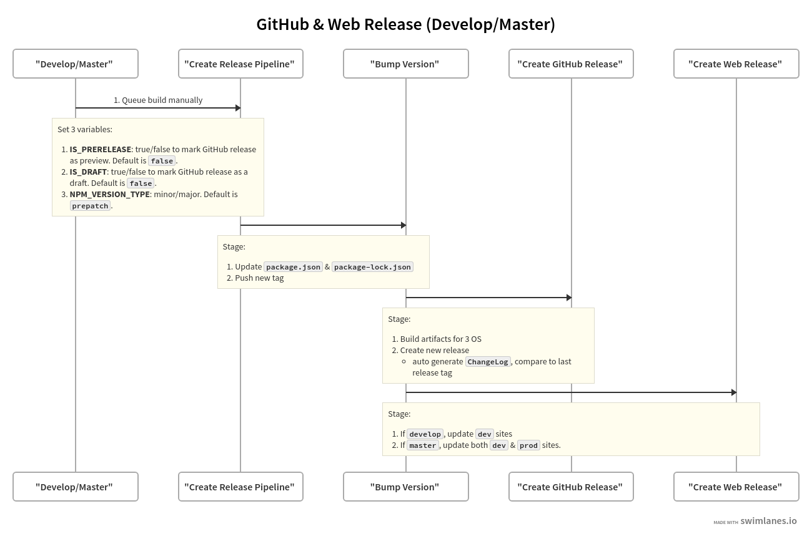

# Overview

Instruction on how to create new GitHub & Web Releases.

## Release Process

## Versioning

Follow [NPM Semantic Versioning](https://docs.npmjs.com/about-semantic-versioning#incrementing-semantic-versions-in-published-packages)

| Code status                               | Stage         | Rule                                                               | Example version |
| ----------------------------------------- | ------------- | ------------------------------------------------------------------ | --------------- |
| First release                             | New product   | Start with 1.0.0                                                   | 1.0.0           |
| Backward compatible bug fixes             | Patch release | Increment the third digit                                          | 1.0.1           |
| Backward compatible new features          | Minor release | Increment the middle digit and reset last digit to zero            | 1.1.0           |
| Changes that break backward compatibility | Major release | Increment the first digit and reset middle and last digits to zero | 2.0.0           |

### Commands

The pipeline use [npm-version](https://docs.npmjs.com/cli/version) to update version

### Pre

All version with `pre`, ie. `preminor` will bump the appropriate didgit & append `-0` to the new version

Examples:

`npm version prepatch`

1. v2.3.0 --> v2.3.1-0
1. v2.3.1-0 --> v2.3.2-0

`npm version preminor`

1. v2.3.0 --> v2.4.0-0
1. v2.4.0-0 --> v2.5.0-0

#### Exception

`prerelease` behave similar to prepatch, but would increment the last digit.

Examples:

`npm version prerelease`

v2.3.0 --> v2.3.1-0

v2.3.0-0 --> v2.3.0-1

### Major

v2.x.x --> v3.0.0

### Minor

v2.2.0 --> v2.3.0
